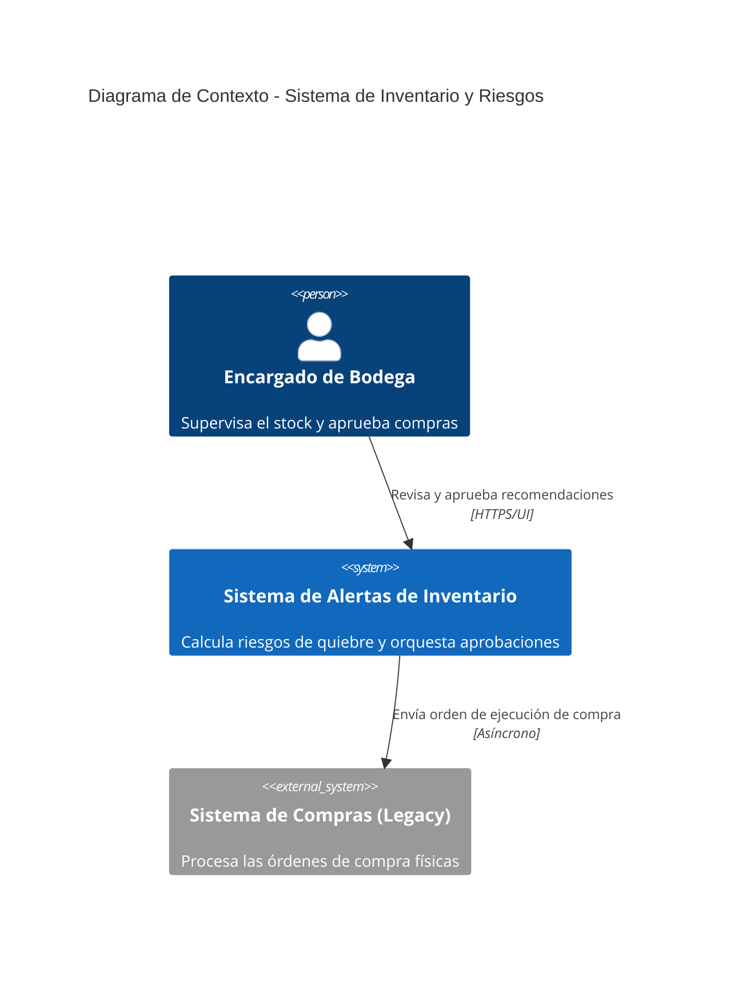
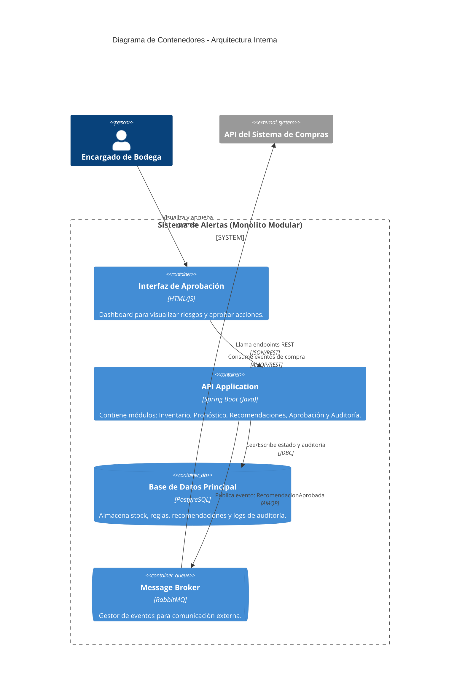

# Entregable: Ejercicio 1 - Gestión de Inventario y Riesgo de Quiebre

## 1. Objetivo, Actores y Alcance
*   **Objetivo:** Diseñar e implementar un sistema predictivo y de control para la cadena de restaurantes que identifique tempranamente el riesgo de quiebre de stock, sugiera acciones correctivas y permita a un supervisor aprobarlas antes de integrarse de forma asíncrona con el sistema de compras existente.
*   **Actores:**
    *   **Encargado de Bodega / Supervisor:** Revisa las alertas de stock, valida el riesgo y aprueba o rechaza las recomendaciones.
    *   **Motor de Pronóstico (Interno):** Analiza las existencias y el consumo histórico para generar sugerencias.
    *   **Sistema de Compras ERP (Externo):** Sistema heredado (existente) que recibe la orden final para ejecutar la compra al proveedor.
*   **Alcance:** Abarca desde la consulta del nivel de inventario, el cálculo de riesgo (pronóstico), la generación de la recomendación, la interfaz humana de aprobación, el registro de auditoría y la emisión del evento hacia el sistema de compras.

## 2. Requisitos Funcionales y de Calidad
*   **Requisitos Funcionales:**
    *   Consultar existencias actuales en las distintas bodegas.
    *   Estimar el riesgo de quiebre de stock y recomendar una acción (compra urgente o transferencia entre bodegas).
    *   Proveer una interfaz para que el encargado apruebe la recomendación.
    *   Registrar una auditoría inmutable de quién aprobó qué y cuándo.
    *   Notificar al sistema de compras una vez que la recomendación es aprobada.
*   **Atributos de Calidad:**
    *   **Desacoplamiento Temporal:** El sistema debe seguir funcionando y permitiendo aprobaciones incluso si el ERP de compras externo está caído.
    *   **Tolerancia a Fallos:** Si el servicio de pronóstico falla, el sistema debe degradarse elegantemente permitiendo la creación manual de solicitudes de compra basadas en el inventario actual.
    *   **Trazabilidad:** Toda decisión algorítmica y humana debe quedar registrada.

## 3. Diagramas C4

### Diagrama de Contexto (Nivel 1)

### Diagrama de Contenedores (Nivel 2)

## 4. Flujo de una Operación Crítica (Aprobación de Quiebre)
1. **Detección:** El módulo de *Pronóstico* detecta que el producto "Papas Fritas" llegará a stock cero en 2 días.
2. **Generación:** El módulo de *Recomendaciones* crea un registro en PostgreSQL sugiriendo "COMPRA URGENTE de 100 unidades" con estado `PENDIENTE`.
3. **Revisión:** El encargado accede al frontend, revisa la alerta y hace clic en "Aprobar".
4. **Auditoría y Estado:** La API de Spring Boot (módulo de *Aprobación*) cambia el estado en la base de datos a `APROBADA` y guarda en el módulo de *Auditoría* el timestamp y usuario.
5. **Integración:** La API publica un evento en RabbitMQ con el payload de la compra.
6. **Ejecución Externa:** El sistema de compras existente, suscrito a RabbitMQ, lee el evento a su propio ritmo y genera la orden al proveedor.

## 5. Stack Propuesto y Justificación Arquitectónica
*   **Estilo Arquitectónico:** Monolito Modular.
    *   *Justificación:* Para este dominio cohesionado, separar inventario, pronóstico, recomendaciones, aprobación y auditoría en microservicios independientes por red agregaría latencia, complejidad de despliegue y sobrecarga operativa innecesaria. Un Monolito Modular en Spring Boot permite una separación estricta del código mediante paquetes (packages) manteniendo la simplicidad transaccional de una sola base de datos.
*   **Backend:** Spring Boot (Java 17). Robusto, tipado estático, ideal para reglas de negocio complejas y excelente integración con mensajería (Spring AMQP).
*   **Base de Datos:** PostgreSQL. Necesario para mantener la integridad referencial entre el catálogo de inventario, los estados de las recomendaciones y el registro inmutable de auditoría.
*   **Mensajería:** RabbitMQ. Permite encolar los mensajes hacia el sistema de compras sin afectar el rendimiento de nuestra API.
*   **Infraestructura:** Docker y Docker Compose para garantizar consistencia entre entornos de desarrollo y producción.

## 6. Decisiones de Arquitectura y Tecnología (ADRs)

### ADR 1 (Decisión Arquitectónica): Método de Integración con el Sistema de Compras
*   **Contexto:** El sistema existente de compras suele ser pesado (ERP) y puede sufrir caídas o lentitud. 
*   **Decisión:** La recomendación aprobada se **publicará como un evento** en un Message Broker (RabbitMQ) en lugar de consultar o empujar datos mediante una API REST síncrona.
*   **Consecuencia:** Alta disponibilidad para el usuario. El encargado puede aprobar 50 recomendaciones en segundos sin esperar a que el ERP responda. Garantiza la entrega (at-least-once) mediante la persistencia en colas.

### ADR 2 (Decisión Tecnológica): Fallback para el Servicio de Pronóstico
*   **Contexto:** El algoritmo o servicio que calcula el pronóstico de quiebre puede dejar de estar disponible por fallos técnicos o falta de datos.
*   **Decisión:** Implementar un patrón de *Degradación Elegante (Graceful Degradation)*. Si el pronóstico automático no responde, la UI habilitará un modo "Manual" donde el sistema muestra los niveles de inventario crudos (módulo de inventario base) y el encargado puede crear y aprobar la recomendación basándose en su criterio empírico.
*   **Consecuencia:** El negocio no se detiene por la caída de la capa predictiva, priorizando la continuidad operativa.

## 7. Riesgos y Plan de Mitigación
1.  **Riesgo:** Pérdida de mensajes de eventos de compra hacia el ERP por reinicios del servidor.
    *   **Mitigación:** Configurar RabbitMQ con intercambios (exchanges) y colas "durables", y publicar los mensajes en modo persistente. Implementar un patrón *Outbox* en PostgreSQL para conciliar que toda recomendación aprobada tenga su correlato emitido.
2.  **Riesgo:** El motor de pronóstico genera recomendaciones erróneas (falsos positivos) generando compras excesivas.
    *   **Mitigación:** La arquitectura impone estrictamente un "Human-in-the-loop" (interfaz de aprobación). Además, se configurarán alertas anómalas en la UI si el volumen sugerido supera el 200% del promedio histórico.
3.  **Riesgo:** Modificaciones no autorizadas en las aprobaciones (fraude interno).
    *   **Mitigación:** El módulo de auditoría utilizará una tabla `append-only` (solo inserción) en PostgreSQL. Cualquier cambio de estado a `APROBADA` insertará obligatoriamente un nuevo registro inmutable detallando el usuario y el timestamp.

## 8. Métricas
*   **Métrica de Negocio:** *Tasa de Quiebre de Stock (Stockout Rate).* Porcentaje de productos que llegan a existencia cero en los restaurantes antes de recibir la reposición. Debe disminuir tras la implementación.
*   **Métrica Técnica:** *Tiempo de Respuesta en Aprobación / Latencia de Publicación.* Tiempo en milisegundos desde que el usuario hace clic en "Aprobar" hasta que la API guarda en la BD, publica el evento en RabbitMQ y responde HTTP 200. (Objetivo: < 200ms).